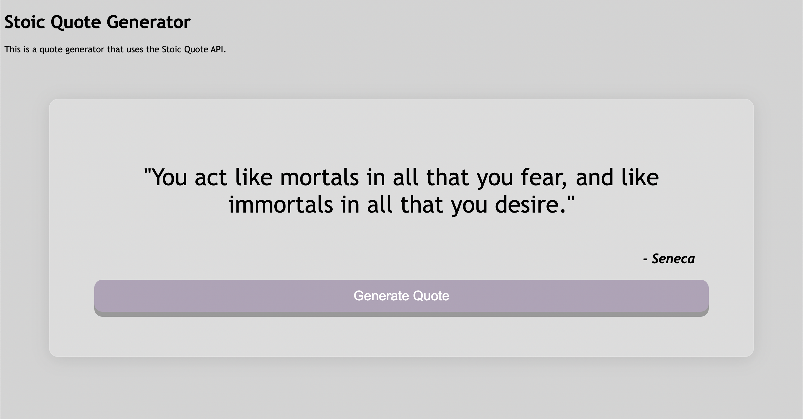

# Stoic Quotes Generator

Short project from Codecademy, part of the Full Stack Developer career path. The applications calls upon the Stoic API and returns a randomly generated quote from a Stoic.

## Usage

The application can be run locally in browser by using: 

```npx live-server```

